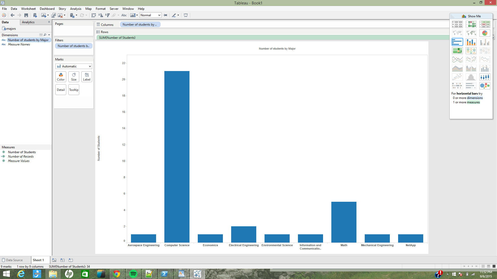
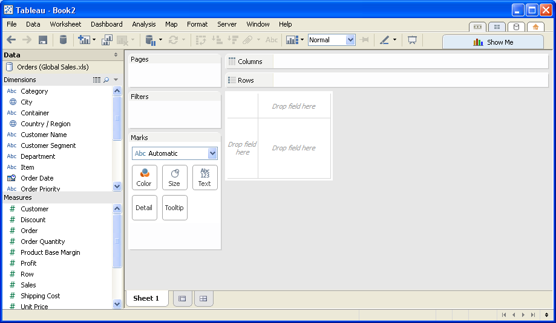

# Tableau Visualization

Tableau is arguably the biggest deal now in terms of data visualization for non-programmers.
Let's pretend you are not a programer. Learn and experience what it is like to make
visualizations using Tableau to answer the same questions about your classmates in our course.

For each of the question, think about what chart you should use to convey your answer and
make your best effort to create something that makes sense to you. There's no right
or wrong. When we meet in the class again, we will set aside time for each team to discuss
and compare the variety of visualization solutions each member has come up with for the
same set of questions. It will be fun!

To include a Tableau visualization in your report, take a screenshot, save it as an image,
put it in the `learning/week2` folder, and replace ``  with
your own image. Please makes sure your screenshot includes the _entire_ Tableau interface
including the controls, widgets ...etc.

# How big the deal Tableau really is?

"During the second quarter, Tableau reported international revenue of
$36.7 million, an 83 percent growth rate over the same period last year.
Total revenue at the company was up 67 percent."

-An excerpt from GeekWire on Tableau's 2015 revenue and growth.

http://www.geekwire.com/2015/data-visualization-giant-tableau-opens-new-office-in-china/

# How many students submitted after the first day of class?

(write your explanation for the reader as to where to look at this chart in order
    to see the answer)

# How many students submitted after the first day of class?

(write your explanation for the reader as to where to look at this chart in order
    to see the answer)

# Who was the first person to submit Sushi as their favorite food?

(write your explanation for the reader as to where to look at this chart in order
    to see the answer)

# How many people submitted before noon overall?

(write your explanation for the reader as to where to look at this chart in order
    to see the answer)
