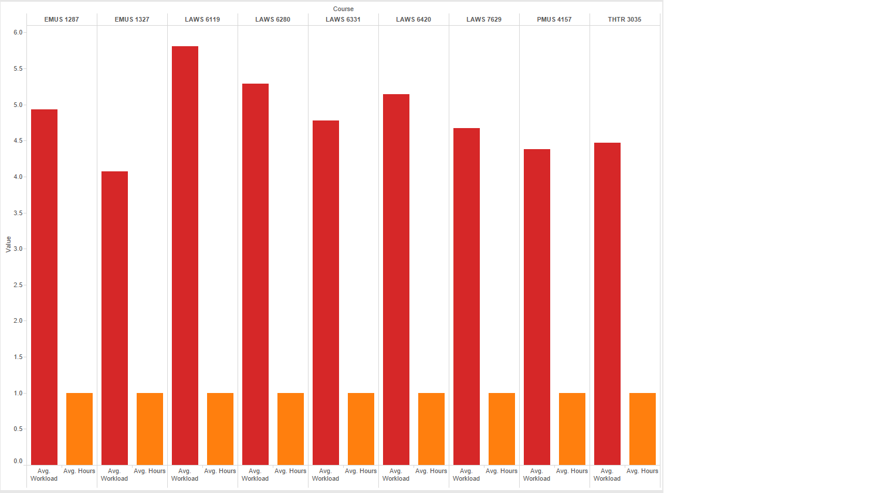
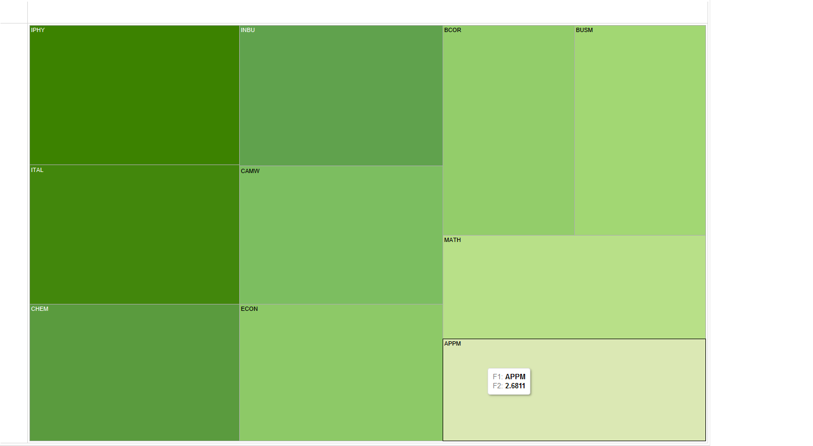
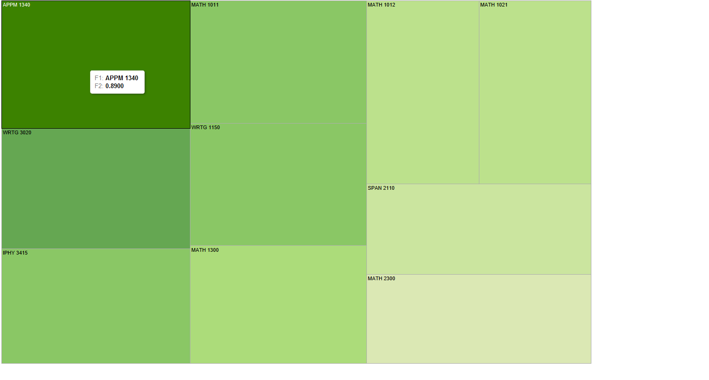
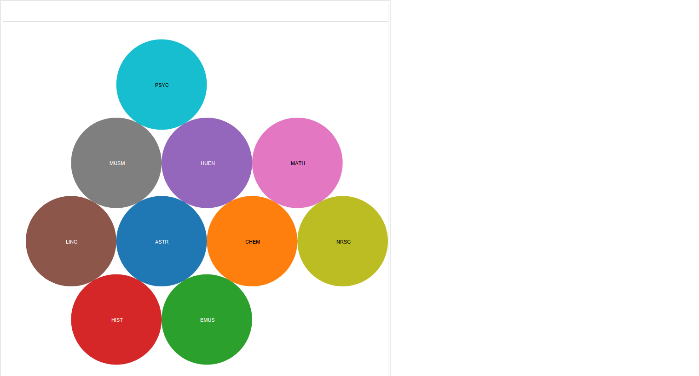
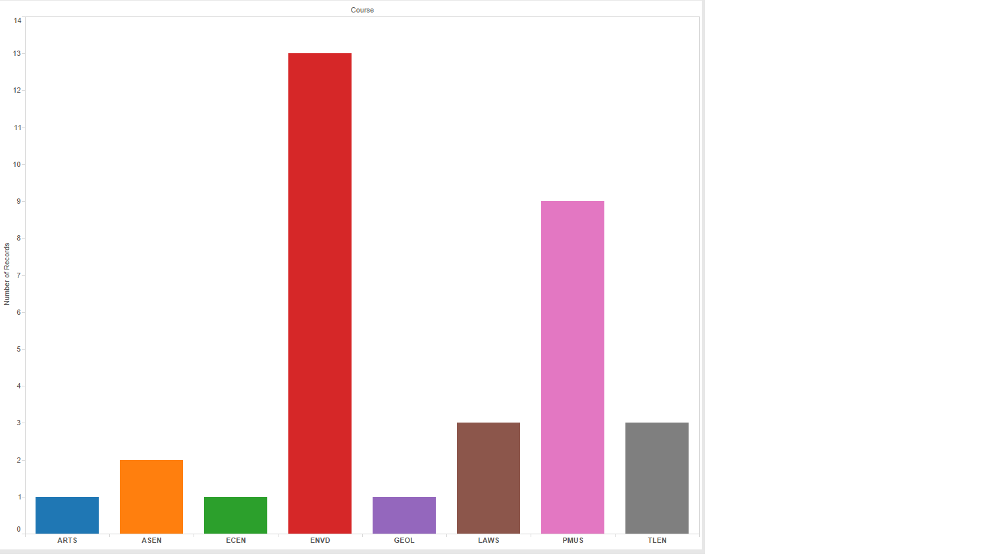

# Visualization

Using Tableau, create visualization for each question in the report. You will
work on this independently just like last week.

To include a Tableau visualization in your report, take a screenshot, save it as an image,
put it in the `learning/week2` folder, and replace ``  with
your own image. Please makes sure your screenshot includes the _entire_ Tableau interface
including the controls, widgets ...etc.

# Import

Data: [fcq.clean.json](https://github.com/bigdatahci2015/book/blob/master/hackathons/fcq/fcq.clean.json)

(a copy of this file is in your book repository already in the directory `hackathons/fcq`)

This dataset is provided to you in the JSON format. Your first task is to figure out
how to transform this JSON file into a format that can be fed into Tableau. As
a junior and senior, you are expected to be able to look around the Internet
to problem solve.

# What classes have very different workloads compared to credit hours? by John Cronk

The red bars under each course indicate the Workload value, while the orange bars indicate
the Hours.  Shown are courses whose Workload & Hours values are most different (either much smaller or larger).

# What department has the lowest average GPA? by Nicole Woytarowicz

Shown here are the bottom ten departments in terms of GPA, with APPM at the bottom with 2.68.

# Which classes(with specific professors) damaged the most students (sort by:C + D + F rating)? by Denis Kazakov

Shown here are the top ten courses in terms of percent of students who achieved a C or less.
The size of the box indicates the size the ratio, with the largest at ~89%.

# What department should I take classes in if I want to boost my GPA? by Caleb Hsu

Shown here are the departments whose students all received A's in reported classes.

# Which classes have the maximum Hours spent (16+) per week? by Parker Illig

Shown here are the classes which were ranked as 16+ hour workloads.